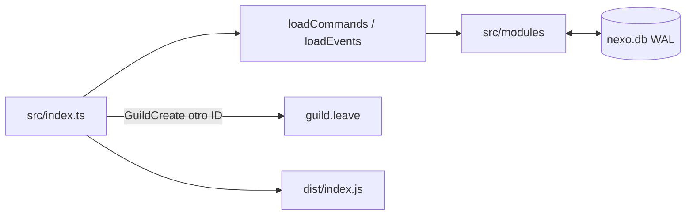

# Arquitectura de Nexo Bot

Bot **single-tenant** para el servidor Nexo. TypeScript + discord.js v14 + SQLite (`better-sqlite3`). Un contenedor.

## Boot (`src/index.ts`)

`initDatabase()` → fuentes Canvas → `NexoClient` → carga recursiva de `src/commands/` y `src/events/` → logs → scheduler → login. En `ClientReady` despliega slash **solo** en el guild oficial. Si entra en otro servidor, sale. SIGTERM reembolsa mesas de casino abiertas.

## Módulos (`src/modules/`)

Los events de Discord son delgados. La lógica está en motores:

| Área | Archivos | Qué hace |
| --- | --- | --- |
| Moderación | `moderation/*` | Casos, apelaciones, acciones masivas |
| AutoMod | `automod/engine.ts` | Spam, invites, links, caps, bad words |
| VoiceMaster | `voicemaster/manager.ts` | Hub → canal temporal + panel |
| Niveles | `levels/engine.ts` | XP chat/VC, ×1.5 boosters, Canvas |
| Tickets | `tickets/*` | Categorías, Neko, transcripts HTML |
| IA | `ai/client.ts`, `memory.ts` | Failover de proveedores + memoria por ticket |
| Economía | `economy/*` | nexocoin, tienda, P2P, trading, impuestos, ledger (`transactionLogger.ts`) |
| Asaltos | `economy/heist.ts`, `heistEngine.ts`, `heistQTE.ts`, `heistCanvas.ts` | `/asalto`: roles, objetivos, QTE, HUD |
| Backup | `backup/create.ts`, `restore.ts` | ZIP restaurable |
| Misiones / RPG / pets | `missions`, `rpg`, `pets` | Engagement a largo plazo; varias mascotas por usuario |
| Comunidad | `community/*`, `bump`, `counting` | Cumples, DISBOARD, juego de contar |
| Logs | `logs/register.ts`, `logs/dispatch.ts` | Audit + deletes + voz; `/logs` para mapear canales |

## Pool de IA (Neko)

Orden en `buildAttempts`: local (Ollama) → Groq → Gemini (varias claves) → OpenRouter → Cohere → Cloudflare Workers AI → OpenAI. Un 429 pone cooldown a ese proveedor.

## Schema

`database/schema.ts` declara el modelo (casos, tickets, economía, asaltos, transacciones, RPG, pets, misiones, counting, invites, boosts…). WAL y foreign keys.

## Docker

Un servicio. Volúmenes `./data` y `./backups`. Token y claves en `.env` (Zod en `config.ts`). El logo de producto está en `assets/images/nexo.png`.
